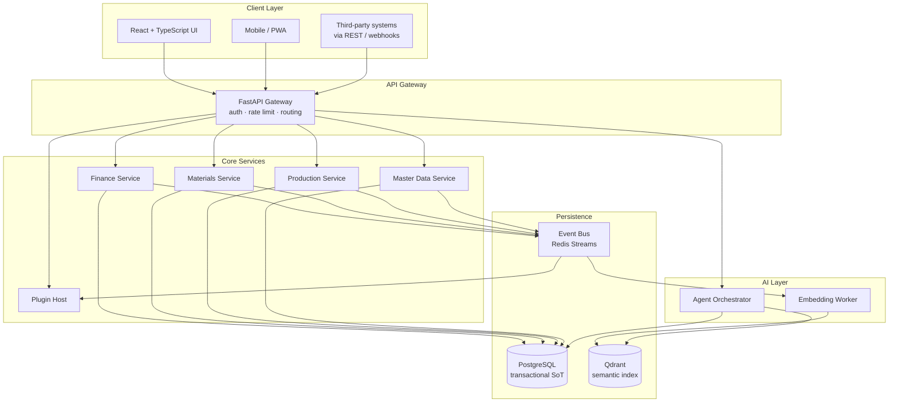
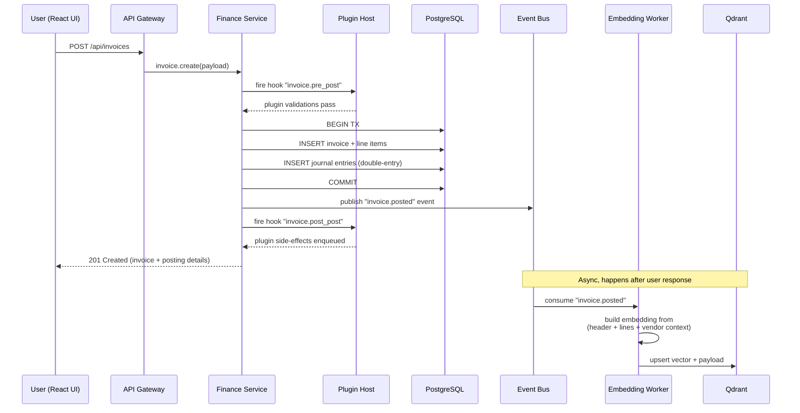
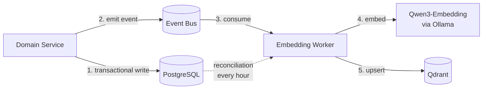
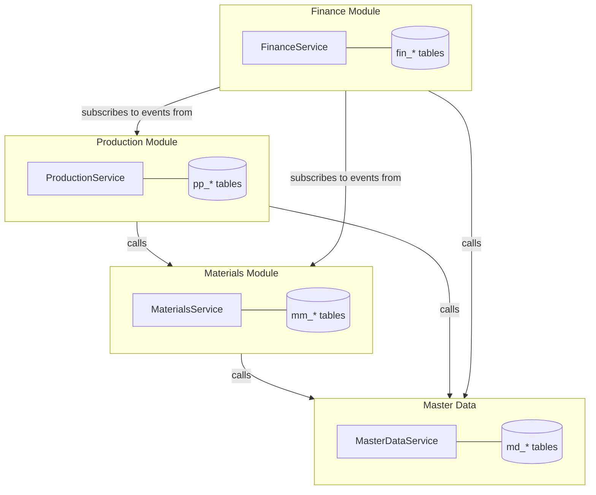
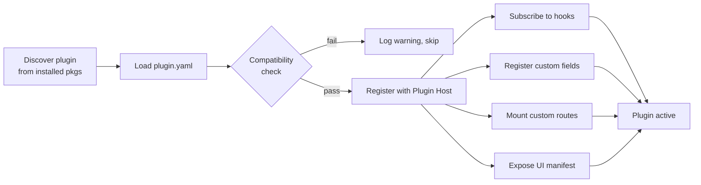
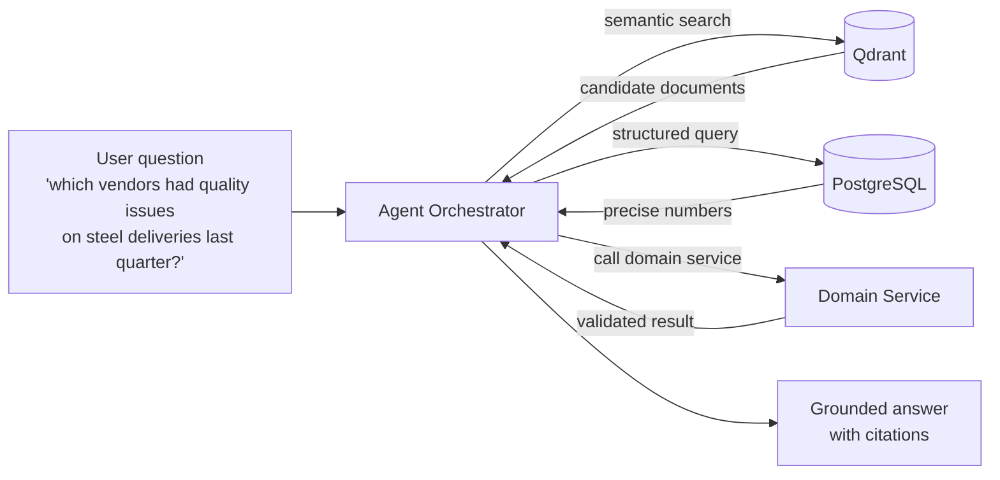
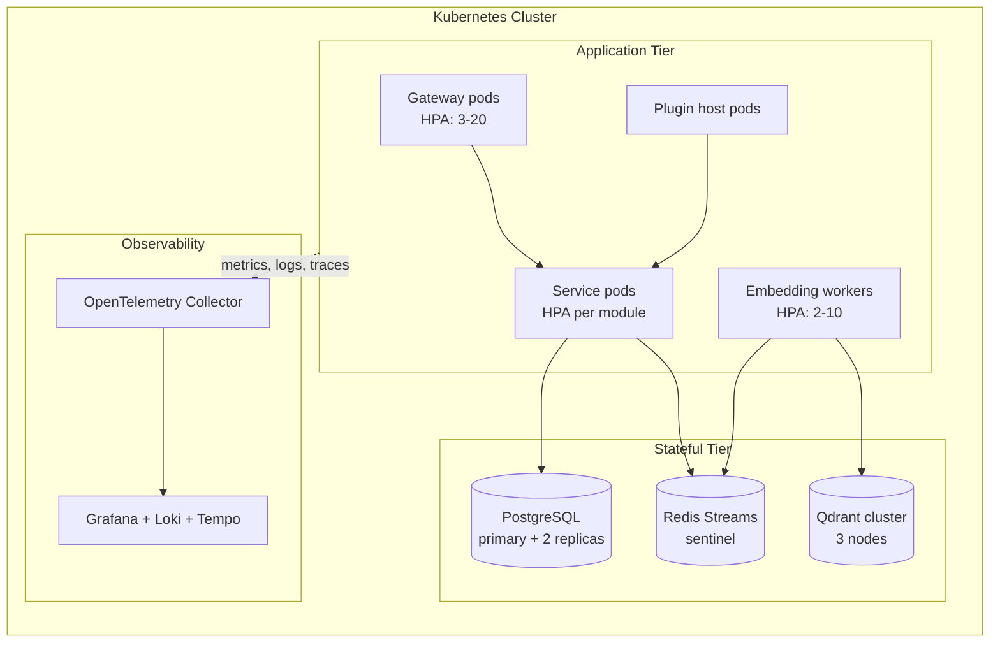

# OpenSpine — Architecture

This document describes how OpenSpine is designed internally, how data flows through the system, and — most importantly — how you extend it without ever forking the core.

---

## 1. System Overview



---

## 2. Layered Architecture

OpenSpine is organised in strict layers. Dependencies flow downward — a higher layer may depend on a lower one, never the reverse.

| Layer | Purpose | Examples |
|-------|---------|----------|
| **Presentation** | User-facing interfaces | React UI, mobile PWA, REST clients |
| **API Gateway** | Authentication, routing, rate limiting | FastAPI, OAuth 2.1, API keys |
| **Domain Services** | Business logic per module | Finance, Materials, Production, Master Data |
| **Plugin Host** | Loads and runs community plugins | Hook dispatcher, plugin registry |
| **Event Bus** | Asynchronous fan-out of business events | Redis Streams |
| **Persistence** | Durable state | PostgreSQL (facts), Qdrant (semantics) |
| **AI Orchestration** | Cross-cutting agentic capabilities | Agent runtime, embedding worker |

---

## 3. The Journey of a Transaction

Here is what happens when a user posts an invoice:



Key properties:

- The user gets a response **before** semantic indexing happens — no vector latency blocks the hot path
- Plugin hooks run *inside* the service transaction (pre-post) or *outside* via the event bus (post-post, async)
- The PostgreSQL transaction is the single source of truth; if indexing fails, a reconciliation job replays it

---

## 4. The Dual-Write Pattern

Every business entity that matters is written in two places:



**Why not pgvector?**

pgvector is excellent and we keep it on the table as an alternative for smaller deployments. We default to Qdrant because it scales independently from the transactional database, its filtering and hybrid search are purpose-built, and its operational model is battle-tested under our pattern.

**Consistency model:** PostgreSQL is the authoritative record. Qdrant is an eventually-consistent derivative. A reconciliation job replays events that failed to index.

---

## 5. Module Boundaries

Each domain module owns its tables, its services, and its public API. Modules **do not** read each other's tables directly — they call each other's services.



Table name prefixes (`fin_`, `mm_`, `pp_`, `md_`) make module ownership visible at a glance. Crossing boundaries means calling a service, never a JOIN.

---

## 6. Plugin & Extension Architecture

This is the section you read OpenSpine for. **You never fork the core.**

### 6.1 Plugin Lifecycle



Plugins are discovered at startup via Python entry points. No scanning, no magic — a plugin registers itself in its own `pyproject.toml`:

```toml
[project.entry-points."openspine.plugins"]
acme = "acme_plugin:plugin"
```

### 6.2 Extension Mechanisms at a Glance

| Mechanism | Use when you need to… | Lives in |
|-----------|----------------------|----------|
| **Configuration** | Change settings, tolerances, number ranges, account determination | DB config tables |
| **Custom fields** | Add new data attributes to standard entities | Plugin-owned columns |
| **Hook points** | Inject validation or side-effects into standard business transactions | Plugin Python code |
| **Custom endpoints** | Expose new APIs or entire industry modules | Plugin Python code |
| **UI extensions** | Add menus, tabs, dashboards, replace field renderers | Plugin React components |
| **Event subscriptions** | React to business events asynchronously (emails, integrations) | Plugin Python code |

### 6.3 Hook Catalogue (excerpt)

Every business transaction exposes a consistent set of hook points. A deliberate, documented, versioned set — not scattered ad-hoc events.

| Hook | When it fires | Can it abort? |
|------|---------------|---------------|
| `invoice.pre_post` | Before the invoice posting transaction | Yes (raise ValidationError) |
| `invoice.post_post` | After the invoice posting committed | No (async side-effects only) |
| `purchase_order.pre_create` | Before PO is persisted | Yes |
| `purchase_order.pre_release` | Before PO changes status to Released | Yes |
| `material.pre_save` | Before material master is written | Yes |
| `goods_receipt.post_post` | After GR committed; stock updated | No |
| `production_order.pre_confirm` | Before confirmation writes actuals | Yes |
| `period_close.pre_run` | Before month-end closing starts | Yes |

Breaking changes to the hook contract follow a two-release deprecation cycle. Non-breaking additions happen continuously.

### 6.4 Hook handler example

```python
# acme_plugin/hooks.py
from openspine.hooks import hook
from openspine.errors import ValidationError

@hook("invoice.pre_post")
def enforce_turkish_tax_id(ctx, invoice):
    """
    Turkish VAT registration requires a 10-digit tax ID
    on every invoice billed to a Turkish customer.
    """
    if invoice.bill_to_country != "TR":
        return
    if not invoice.custom_fields.get("tax_id"):
        raise ValidationError(
            field="custom_fields.tax_id",
            message="Turkish tax ID is required for TR invoices."
        )

@hook("goods_receipt.post_post", async_=True)
async def notify_quality_on_high_value_gr(ctx, gr):
    """
    Email the QA team whenever we receive a high-value batch.
    """
    if gr.total_value_local_currency < 100_000:
        return
    await ctx.notify.email(
        to="qa@acme.com",
        subject=f"High-value goods receipt {gr.id}",
        body=f"Material {gr.material_id}, qty {gr.quantity}"
    )
```

### 6.5 Custom field example

```python
# acme_plugin/fields.py
from openspine.extensibility import extend_entity, FieldDef

extend_entity(
    "md.Customer",
    FieldDef(
        name="turkish_tax_office",
        type="string",
        max_length=60,
        nullable=True,
        indexed=True,
        visible_in=["ui", "api", "semantic_index"],
    ),
)
```

That single declaration:

- adds a column `ext_turkish_tax_office` to the customer table via migration
- exposes the field in the Customer REST API
- renders it on the Customer UI (in a "Custom" section) automatically
- includes it in the semantic embedding payload, so agents can reason about it

### 6.6 Plugin manifest

```yaml
# plugin.yaml
name: acme-openspine-plugin
version: 1.2.0
openspine_compatible: ">=1.0,<2.0"
description: "Acme-specific customisations for Turkish regulatory compliance."
author: "Acme Corp"

hooks:
  - invoice.pre_post
  - goods_receipt.post_post

custom_fields:
  - entity: md.Customer
    field: turkish_tax_office

routes:
  - prefix: /acme
    module: acme_plugin.endpoints

ui:
  menu_items:
    - label: "TR Compliance"
      route: /acme/compliance
      icon: shield
  entity_tabs:
    - entity: md.Customer
      label: "TR Details"
      component: acme_plugin.ui.CustomerTrTab
```

### 6.7 Distribution

Plugins are ordinary Python packages. Three distribution modes:

- **Private** — install from a private PyPI index or a git URL. Never leaves your company.
- **Public** — publish to PyPI. Anyone can install.
- **Marketplace** — submit to the OpenSpine Plugin Marketplace (coming with v0.5). Curated, signed, rated by the community.

A company's typical deployment combines all three: core OpenSpine, a handful of community plugins from the marketplace, and one or two private plugins for company-specific logic.

---

## 7. AI Agent Integration — The Primary Interface

AI agents are not an add-on in OpenSpine — they are the **primary users** of the system. Every API, every data model, every error response, and every piece of documentation is designed for agent consumption first, human consumption second.

Traditional ERPs require armies of functional consultants (who understand business processes) and technical consultants (who understand the system internals). OpenSpine is designed so that AI agents fill both roles — configuring modules, writing business rules, troubleshooting issues, and operating the system day-to-day. Human experts remain in the loop for oversight and edge cases, but the system assumes an agent is driving.

This means:

- **API responses are self-describing.** Every endpoint returns structured metadata that agents can reason over — available actions, validation rules, field semantics, and relationship context.
- **Documentation is agent-consumable.** Schema definitions, business rules, and configuration options are machine-readable first, human-readable second.
- **Error messages are actionable.** Errors include structured context (what failed, why, what to try) so agents can self-correct without human intervention.
- **Configuration is programmable.** Everything a human consultant would click through in a UI, an agent can drive through APIs.



Agents follow a deliberate pattern:

1. **Semantic recall** from Qdrant to find *candidates* — documents, materials, customers that look relevant
2. **Structured verification** in PostgreSQL to get the *facts* — exact numbers, dates, statuses
3. **Action** through domain services, which enforce business rules and write through the same transactional path any user would

Agents never bypass business rules. An agent posting an invoice goes through the same validation, same hooks, same audit trail as any other caller. The difference is that agents are the *expected* primary caller — the APIs are shaped for them.

### 7.1 Agent Roles

OpenSpine recognises two categories of agent that mirror traditional ERP consulting:

| Role | Traditional ERP | OpenSpine |
|------|----------------|-----------|
| **Functional consultant** | Human expert who configures business processes, account determination, number ranges, organisational structures | AI agent that understands domain semantics and drives configuration through APIs |
| **Technical consultant** | Human expert who writes custom code, builds integrations, debugs system behaviour | AI agent that writes plugins, hooks, and extensions using the OpenSpine SDK |
| **End user / operator** | Human who executes transactions — posts invoices, creates POs, confirms production | AI agent that executes business transactions, with human oversight where required |

Human experts are not replaced — they are elevated. They supervise agents, handle exceptional cases, and make strategic decisions. But the system's default assumption is that an agent is at the controls.

---

## 8. Event Bus

Redis Streams is the default backbone. Every domain service publishes events for significant state changes:

```
finance.invoice.posted
finance.invoice.cancelled
finance.payment.received
mm.purchase_order.created
mm.purchase_order.released
mm.goods_receipt.posted
pp.production_order.created
pp.production_order.confirmed
master_data.material.created
master_data.material.updated
```

Consumers include:

- the **Embedding Worker** — keeps Qdrant in sync
- the **Plugin Host** — dispatches async hook handlers
- **External integrations** — webhook forwarder for third-party systems

Events are append-only and replayable. Losing Qdrant or a plugin's sink is a non-event: replay from the last checkpoint.

---

## 9. Deployment Topology

A reference deployment:



A smaller deployment — single node, Docker Compose, SQLite-less-but-Postgres-included — is fully supported for SMBs and single-site installations.

---

## 10. Non-Negotiables

A few architectural commitments that will not change:

1. **AI-first, always.** Every API, schema, error message, and document is designed for agent consumption first. Human interfaces are built on top, never the other way around.
2. **Core stays monolithic for now.** One deployable, one codebase, clear module boundaries. Microservices come later, only if scale demands it.
3. **PostgreSQL is the source of truth.** Everything else is a derivative that can be rebuilt.
4. **Plugins never fork core.** If the core needs a change to support your case, we merge upstream. Extensions stay external.
5. **AGPL forever.** No relicensing, no enterprise edition, no bait-and-switch.
6. **Agents obey business rules.** No backdoor writes. Agents use the same services all callers do.

---

*This document evolves with the code. Questions, corrections, and proposals are welcomed as pull requests.*
