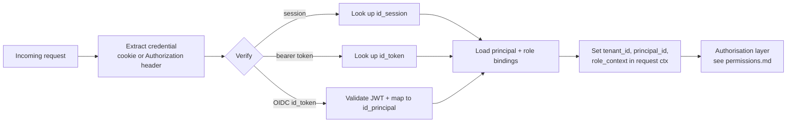

# Authentication

How principals prove who they are. Authorisation (what they are allowed to do) is covered in [permissions.md](./permissions.md); this doc is strictly about identity proof.

## Goals

- **Passwordless by preference.** Modern auth (WebAuthn passkeys, SSO) is the default. Passwords are supported but not encouraged.
- **Uniform treatment.** Humans, agents, and technical accounts all produce the same downstream principal context. Only the authentication mechanism differs.
- **Auditable.** Every authentication attempt — success or failure — is logged with enough context to investigate without being enough to replay an attack.
- **No bearer secrets in logs.** Tokens are hashed at storage, never logged in full.

## Authentication methods

### Human principals

| Method | When to use | Notes |
|--------|-------------|-------|
| **SSO / OIDC / SAML** | Default for enterprise customers with an identity provider | Federation with Entra ID, Okta, Keycloak, Google Workspace, etc. |
| **Passkey (WebAuthn)** | Default for self-hosted and smaller deployments | Passwordless, phishing-resistant. |
| **Password + TOTP** | Fallback | Argon2id hashing; TOTP (RFC 6238) or HOTP. Password policy configurable per tenant with safe defaults. |
| **Magic link** | Onboarding / password reset | Short-lived signed link to an email. Not a permanent auth mechanism. |

Sensitive operations (tenant admin changes, release of large payments, SoD overrides) require **step-up authentication** even within an active session — an additional passkey / TOTP check.

### Agent principals

Agents authenticate with **agent tokens**. Properties:

- Short-lived (default 24 hours, max 7 days)
- Scoped to specific permissions at issuance — the token carries the scope; the runtime enforces it
- Revocable — a single registry; one lookup per request
- Provenance-tracked — the token carries a reference to the human principal who issued it

Agent tokens are issued through the same API that humans use to create API tokens, with the additional scope / expiry / reasoning requirements. An agent cannot issue another agent token (no privilege escalation).

### Technical accounts

Technical accounts authenticate with **API tokens**:

- Long-lived (but should be rotated; system surfaces age)
- Scoped at issuance (role + org units)
- Rotation is supported without downtime (overlapping validity window)

API tokens and agent tokens share the `id_token` table; the distinction is in the principal type and the token constraints.

## Sessions

For humans:

- Sessions are stored server-side in `id_session` with an opaque session identifier in a secure, HttpOnly cookie.
- Idle timeout (default 30 minutes), absolute timeout (default 12 hours), both tenant-configurable.
- Concurrent session limit per principal configurable.
- Logout invalidates the session row; subsequent cookie use fails.

Agents and technical accounts do not have sessions — every request is authenticated stateless via token.

## Request flow

The authentication layer produces a **principal context** — tenant, principal ID, effective roles, scope ranges, token constraints. Everything downstream operates on this context.

## Token security

- Tokens are random 256-bit values, base64url-encoded, prefixed for visual identification (`osp_user_`, `osp_agent_`, `osp_svc_`).
- Stored as `argon2id(secret)` in `id_token`. Never stored in plaintext anywhere.
- On creation, the plaintext is shown once to the caller. Lost = regenerate; no recovery.
- `id_token.last_used_at` updated on each use for staleness detection.
- Unused tokens older than N days (configurable) can be auto-revoked.

## Audit

Every authentication attempt generates an `id_audit_event`:

- `auth.login.success` / `auth.login.failure`
- `auth.step_up.success` / `auth.step_up.failure`
- `auth.token.issued` / `auth.token.revoked` / `auth.token.used`
- `auth.sso.federation_linked` / `auth.sso.federation_unlinked`
- `auth.session.created` / `auth.session.expired` / `auth.session.revoked`

Correlated by `trace_id` across the request lifecycle. IP, user agent, and geolocation (if configured) captured with privacy controls.

## Protection mechanics

- Rate limiting per IP and per principal on failed attempts (exponential backoff).
- Brute-force lockout (N failures → timed lock) with admin override.
- Compromised-credential alerts via email / webhook when a login succeeds from a new geography, a new device fingerprint, or uses a credential flagged for rotation.
- No account enumeration — login failure messages do not distinguish "unknown user" from "wrong password".

## SSO / federation

- OIDC providers are configured at the tenant level.
- A human principal can link an external identity (`id_federated_identity`) — issuer, subject, linked_principal_id.
- On SSO login, OpenSpine validates the ID token, matches to a linked identity, and produces a session. If unlinked and just-in-time provisioning is enabled (per tenant policy), a new principal is created with default role assignments; otherwise login fails.
- SCIM provisioning is a Phase 2 consideration.

## Core tables

| Table | Purpose |
|-------|---------|
| `id_credential` | Per-principal credentials (password_hash, federation link, token registry indirection). |
| `id_session` | Active sessions. |
| `id_token` | Issued tokens with hash, scope summary, expiry, last_used_at, revoked_at. |
| `id_federated_identity` | Per-provider federation mapping to internal principal. |
| `id_audit_event` | Append-only auth + authorisation audit trail. |

## Open questions

1. **Passwordless-only mode.** Should a tenant be able to disable password auth entirely and require passkey / SSO? Yes — good default for enterprise deployments.
2. **Device trust.** Remember-this-device support with device fingerprinting? Useful but adds complexity; revisit.
3. **Agent token scope compactness.** Token format (opaque random bytes + server-side scope lookup) vs self-describing (signed JWT with scope claim)? Opaque + lookup is simpler and more revocable. Default: opaque.
4. **mTLS for technical accounts.** Optional mTLS for high-value service-to-service connections.
5. **Attestation for agent provisioning.** For sensitive agents, require the provisioning human to re-authenticate (step-up) at token creation time — default yes.
