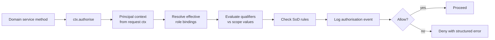

# Permissions

The permission model — how roles translate into enforced authorisation at runtime.

## Model: authorisation objects

Inspired by SAP's auth object model, simplified. An **authorisation object** is a tuple:

```
(domain, action[, qualifier...])
```

Examples:

| Domain | Action | Qualifiers | Human reading |
|--------|--------|-----------|---------------|
| `fi.invoice` | `post` | `company_code`, `amount_range` | "Post an FI invoice in a Company Code up to an amount" |
| `mm.purchase_order` | `release` | `company_code`, `purchasing_org`, `amount_range` | "Release a PO in a scope up to an amount" |
| `co.cost_centre` | `maintain` | `controlling_area`, `cost_centre_range` | "Maintain cost centres in a range" |
| `md.material` | `create` | — | "Create material master records" |
| `system.user` | `create` | — | "Create a user principal" |
| `id.audit` | `read_all` | — | "Read every audit record in the tenant" |

A **permission** is a specific grant: "this single role grants the authorisation object with these qualifier values".

## Why this rather than simple allow-list permissions

- **Scope-aware.** A buyer isn't just "allowed to create POs" — they are allowed to create POs **for Plants 1000–1099 up to 50 000 EUR**. The qualifier model encodes that natively.
- **Declarative.** Services ask "does principal X have authority for `(mm.purchase_order, release)` with `(company_code=DE01, amount=45000 EUR)`?" and get a yes/no. The service never hand-rolls the check.
- **Auditable.** Every check is logged with object, action, qualifier values, and decision.
- **Extensible.** Plugins register new authorisation objects (prefixed with their plugin ID, e.g. `acme.batch_cert.issue`) and core enforces them identically.

## Enforcement



Every service method declares its authorisation requirement explicitly. There is no implicit "admin can do anything" backdoor.

```python
# Illustrative — not final API
@requires_auth("fi.invoice", "post",
               company_code=lambda p: p.company_code,
               amount=lambda p: p.amount_in_local_currency)
async def post_ap_invoice(payload: APInvoicePayload) -> APInvoice:
    ...
```

## Qualifier semantics

Qualifiers are interpreted as scoped grants. When a single role is granted with `company_code=[DE01, DE02]` and `amount_range=[0, 10000 EUR]`:

- `DE01` is allowed ✓, `DE03` is denied ✗
- `5000 EUR` is allowed ✓, `15000 EUR` is denied ✗
- Composite roles compose qualifiers via **union** across single roles (most-permissive wins within the composite) but **intersection** across role bindings (most-restrictive wins across scope qualifiers of the principal).

When multiple role bindings overlap, effective permission is the **union of allowed tuples** — any allowing binding is sufficient.

SoD rules run **before** allowance — a SoD block overrides any allow.

## Currency in amount qualifiers

Amount qualifiers are always stored in a specified reference currency (Company Code local currency by default, with explicit currency as metadata). At check time, the amount under test is converted to the reference currency using the current `M` (average) exchange rate from `md_fx_rate`. Authorisation conversions always use rate type `M` — never `B` (bank-selling) or `G` (bank-buying) — to avoid directional bias in permission checks. Conversion results are logged so audit can reproduce the decision.

## Denial semantics

Denials return structured errors — machine readable, actionable for agents:

```json
{
  "error": "authorisation_denied",
  "domain": "fi.invoice",
  "action": "post",
  "reason": "amount_exceeds_limit",
  "attempted": { "amount": "15000.00", "currency": "EUR" },
  "allowed": { "max_amount": "10000.00", "currency": "EUR" },
  "principal_id": "...",
  "trace_id": "..."
}
```

Generic "access denied" is forbidden. Agents need to *reason* about why they were denied — that is how they self-correct or escalate.

## Permission catalogue (Phase 1 highlights)

Full catalogue will be a generated reference; this is a high-level sample.

| Object | Action | Qualifiers |
|--------|--------|-----------|
| `fi.document` | `post`, `reverse`, `display` | `company_code`, `document_type`, `amount_range` |
| `fi.invoice.ap` | `post`, `park`, `change`, `display` | `company_code`, `amount_range`, `vendor_group` |
| `fi.invoice.ar` | `post`, `park`, `change`, `display` | `company_code`, `amount_range`, `customer_group` |
| `fi.payment` | `propose`, `release`, `cancel` | `company_code`, `amount_range` |
| `fi.period` | `open`, `close` | `company_code`, `account_range` |
| `co.cost_centre` | `maintain`, `display` | `controlling_area`, `cost_centre_range` |
| `co.internal_order` | `create`, `release`, `settle`, `teco` | `controlling_area`, `order_type` |
| `co.allocation` | `define`, `run`, `display` | `controlling_area` |
| `md.business_partner` | `create`, `change`, `display`, `merge` | `role`, `address_country` |
| `md.material` | `create`, `change`, `display`, `flag_for_deletion` | `material_type`, `industry_sector` |
| `md.gl_account` | `create`, `change`, `display` | `chart_of_accounts`, `account_group` |
| `mm.purchase_req` | `create`, `change`, `release`, `display` | `plant`, `purchasing_group`, `amount_range` |
| `mm.purchase_order` | `create`, `change`, `release`, `close`, `display` | `company_code`, `plant`, `purchasing_org`, `amount_range` |
| `mm.goods_movement` | `post`, `reverse` | `plant`, `movement_type` |
| `mm.invoice_receipt` | `post`, `block`, `unblock`, `reverse` | `company_code`, `plant`, `amount_range` |
| `pp.bom` | `maintain`, `display` | `plant`, `material_type` |
| `pp.routing` | `maintain`, `display` | `plant`, `work_centre_range` |
| `pp.mrp` | `run`, `display` | `plant` |
| `pp.production_order` | `create`, `release`, `confirm`, `teco`, `close` | `plant`, `order_type` |
| `system.user` | `create`, `suspend`, `delete`, `display` | — |
| `system.role` | `assign`, `define`, `display` | — |
| `system.token` | `issue`, `revoke`, `display` | — |
| `system.plugin` | `install`, `configure`, `disable`, `display` | — |
| `id.audit` | `read_all`, `read_own` | — |

## Field-level and data-level guards

Authorisation objects handle object/action-level decisions. Two additional guards:

- **Row-level security** in PostgreSQL enforces tenant isolation and certain broad scopes (e.g. Company Code). This is the safety net.
- **Field masking** in service responses hides sensitive fields from principals without the right to see them (e.g. bank account number on a BP is only visible to AP clerks and auditors). Modelled as a per-domain field sensitivity table; enforced in serialisers.

## Plugin extension

A plugin registers additional authorisation objects in its manifest:

```yaml
# plugin.yaml
authorisation_objects:
  - domain: acme.batch_certificate
    actions: [issue, revoke, display]
    qualifiers:
      - plant
      - product_group
```

Core creates the catalogue entries at plugin load. The plugin can now demand authorisation exactly like core:

```python
@requires_auth("acme.batch_certificate", "issue",
               plant=lambda p: p.plant,
               product_group=lambda p: p.product_group)
async def issue_batch_cert(...): ...
```

Plugins **cannot** bypass core auth objects — they can only add new ones.

## Core tables

| Table | Purpose |
|-------|---------|
| `id_auth_object` | Registered authorisation objects. Core-owned by default; plugins register new ones prefixed with plugin id. |
| `id_auth_object_action` | Actions per object. |
| `id_auth_object_qualifier` | Qualifiers per object with data type. |
| `id_permission` | Role → auth object + action + qualifier constraints. |
| `id_sod_rule` | Forbidden combinations of `(auth_object, action)` across roles assigned to the same principal. |
| `id_auth_decision_log` | Append-only decision log — principal, object, action, qualifiers, decision, reason, trace_id. Retention per tenant. |

## Performance notes

- Effective permissions per principal are cached per session with an invalidation bus on role-binding changes. Cache miss on first request, hot on subsequent.
- Qualifier evaluation on hot paths uses pre-compiled interval / set predicates; amount-range checks cost microseconds.
- Decision log writes are async-batched — blocking is unacceptable.

## Open questions

1. **Amount range inflation.** When currencies revalue significantly, `10 000 EUR` today may be `8 000 EUR` in purchasing power next year. Do we revalue amount limits automatically? Probably no — explicit review is the safer default.
2. **Qualifier expression language.** Simple lists + ranges cover 90 %. The 10 % that doesn't (e.g. "materials with hazardous class ≠ A") — is that a full predicate engine or a plugin concern? Start simple; escalate as needed.
3. **Negative permissions ("deny")** in addition to positive grants? SoD handles most of this. A general deny mechanism adds complexity. Probably avoid unless needed.
4. **Audit log volume.** Every authorisation decision is recorded. At scale this is a lot. Options: async batched writes, retention policy per tenant, compress common decisions (sampling on successful reads). Needs benchmarking before v0.1 ships.
5. **Dual-control / four-eyes.** Some decisions require two principals (e.g. release payment > 50 000 EUR). First-class concept or just a specialised workflow? Leaning first-class — `id_dual_control_request` / `id_dual_control_approval` with reference to the underlying auth decision.
