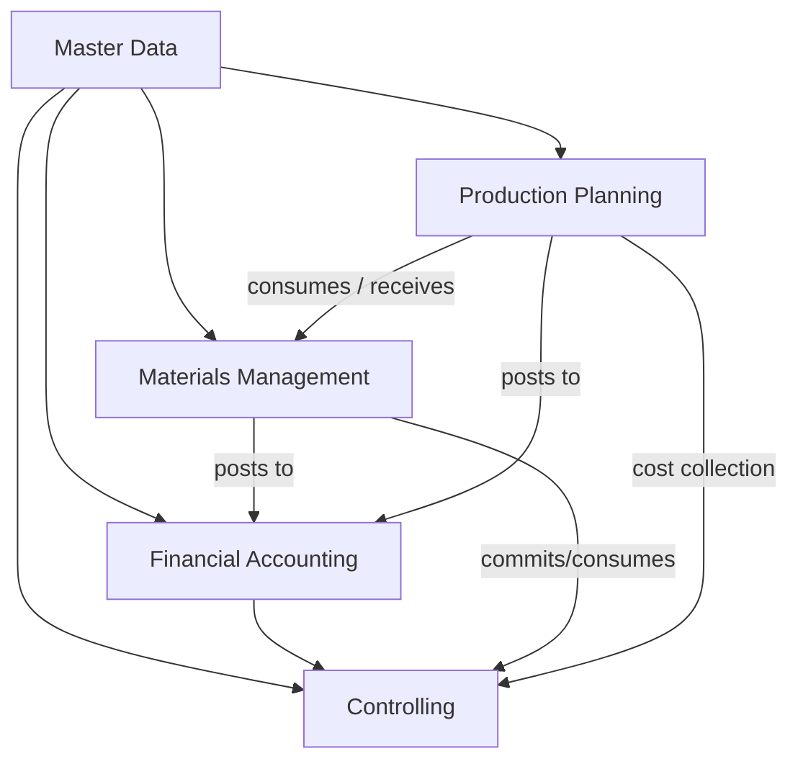

# Modules — Overview

OpenSpine Phase 1 covers the **spine** of any manufacturing or trading business: Financial Accounting, Controlling, Materials Management, and Production Planning, sitting on a shared Master Data foundation.

Each module owns its tables, its services, and its public API. Modules never read each other's tables directly — they call services across module boundaries.

## Phase 1 modules

| Code | Module | Doc | Role |
|------|--------|-----|------|
| **MD** | Master Data | [md-master-data.md](./md-master-data.md) | Organisational units, business partners, materials, CoA, calendars, currencies. Foundation for everything else. |
| **FI** | Financial Accounting | [fi-finance.md](./fi-finance.md) | Legal ledger. GL, AP, AR, document posting, periods. Source of truth for financial reality. |
| **CO** | Controlling | [co-controlling.md](./co-controlling.md) | Management accounting. Cost centers, profit centers, internal orders, allocations. |
| **MM** | Materials Management | [mm-materials.md](./mm-materials.md) | Procure-to-pay operational flow. PR, PO, GR, IR, inventory, valuation. |
| **PP** | Production Planning | [pp-production.md](./pp-production.md) | Plan-to-produce. BOM, routing, work centers, MRP, production orders. |

## Deferred (Phase 2+)

| Module | Why deferred |
|--------|-------------|
| **HR / HCM** | Huge surface; Business Partner skeleton covers employees well enough for Phase 1. |
| **SD** (Sales & Distribution) | AR covers customer invoicing for Phase 1. Full sales order lifecycle comes with v1.x. |
| **PM** (Plant Maintenance) | Out of scope until manufacturing customers demand it. |
| **QM** (Quality Management) | Same. |
| **AA** (Asset Accounting) | Lightweight asset tracking in FI; full AA comes later. |
| **CRM** | Not an ERP concern in our interpretation. |

## Module dependency graph

Dependencies flow one way. No module depends on a module that depends back on it. The event bus is the only path for async cross-module reaction.

Read this as: *PP depends on MM, FI, CO, and MD. MM depends on MD, FI, CO. CO depends on MD, FI. FI depends on MD. MD depends on nothing inside the business domain — only on identity and infrastructure.*

## Implementation sequence

We build in dependency order, because you cannot test FI without MD, cannot test MM without FI, and cannot test PP without MM + CO:

1. **v0.1 — Foundation (MD core).** Tenant, Company Code, Chart of Accounts, Business Partner, Material Master, currencies, FX rates, fiscal year / posting periods. Identity, tenancy, RBAC.
2. **v0.2 — FI core.** Document posting engine, GL, AP, AR, period management. First user-visible business transactions.
3. **v0.2.x — CO foundations.** Cost centers, profit centers, internal orders, assignment on FI documents. Simple allocations.
4. **v0.3 — MM.** Purchase requisition → purchase order → goods receipt → invoice verification. Inventory and valuation. First plugins shipped as examples.
5. **v0.4 — PP.** BOM, routing, work center, MRP, production order, confirmations. Closes the loop — a full make-to-stock cycle is testable end-to-end.
6. **v0.5 — AI agent layer.** Semantic search UI, agentic document understanding, NL reporting.
7. **v1.0 — Production-ready.** Hardened, migration tooling, first pilot deployments.

## Module doc template

All module docs follow this structure for comparability:

1. **Purpose** — one paragraph, what this module is responsible for
2. **Scope — Phase 1** — concrete table of sub-areas IN scope
3. **Scope — explicitly deferred** — what a traditional ERP has here that we defer, and why
4. **Core entities** — the tables this module owns, brief description each
5. **Key transactions / business processes** — end-to-end flows
6. **Integrations** — which other modules it reads from / publishes events to
7. **Hook points exposed** — hooks plugins can subscribe to
8. **AI agent affordances** — what agents should be able to do natively
9. **Open questions** — things we have not decided yet

## Cross-module principles

- **No JOINs across module table prefixes.** If Finance needs a material description, it calls `MaterialService.get(material_id)`, never `SELECT … FROM mm_material …`.
- **Universal journal.** FI and CO share the posting tables (`fin_document_*`). Cost center, profit center, internal order, and other CO dimensions are columns on every line, not separate ledgers. This mirrors S/4HANA's `ACDOCA` philosophy and avoids reconciliation overhead.
- **Events before side-effects.** A module performs its own transactional writes, then publishes an event. Other modules react via subscriptions, not by being called.
- **Master data is authoritative.** If a plant is closed, every module sees it closed on the next read. No caching masters in subscriber modules beyond request-level.
- **Plugins bind at the module boundary.** Hook points exposed by each module are part of its public contract — documented, versioned, and stable.
